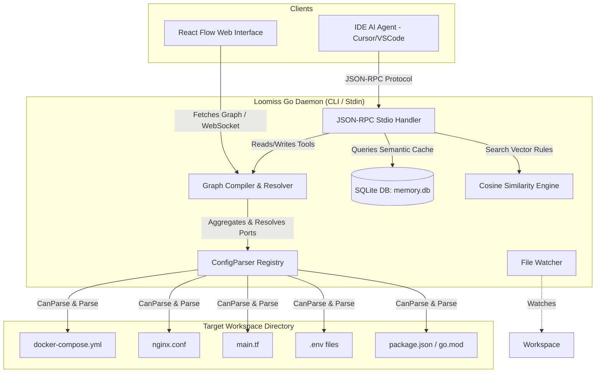

# Loomiss 🌀

[](https://golang.org)
[](https://react.dev)
[](https://opensource.org/licenses/MIT)
[](https://golang.org)
[](https://modelcontextprotocol.io)

**Loomiss** is a standalone, dynamic system architecture visualizer and Model Context Protocol (MCP) server. Written in pure, CGO-free Go, it automatically scans project repositories (Docker Compose, Terraform, Nginx, environment variables, local package/module declarations, and monitoring tools) to compile and render a real-time, hierarchical architecture map in a modern, neon-accented cyberpunk UI.

---

## 📋 Table of Contents

- [Key Features](#-key-features)
- [System Architecture](#%EF%B8%8F-system-architecture)
- [Supported Stack Scanners](#%EF%B8%8F-supported-stack-scanners)
- [Getting Started](#-getting-started)
  - [Prerequisites](#prerequisites)
  - [Installation & Global PATH Setup](#installation--global-path-setup)
- [Usage Guide](#-usage-guide)
  - [Running the CLI Daemon](#running-the-cli-daemon)
  - [Web UI Dashboard](#web-ui-dashboard)
- [Model Context Protocol (MCP) Integration](#-model-context-protocol-mcp-integration)
  - [IDE Registration (Cursor / Antigravity IDE)](#ide-registration-cursor--antigravity-ide)
  - [Exposed Tools](#exposed-tools)
- [Development & Build Instructions](#-development--build-instructions)
  - [Build Frontend Assets](#build-frontend-assets)
  - [Compile Go Daemon Binary](#compile-go-daemon-binary)
  - [Run Tests](#run-tests)
- [License](#-license)

---

## 🌀 Key Features

- **Real-Time Hot-Reloading:** Integrates a background file watcher. Modifying infrastructure configurations instantly re-compiles the graph and broadcasts updates to the Web UI via WebSockets.
- **Hierarchical Tier Grouping (Sub-flows):** Utilizes Dagre compound graph layouts to arrange leaf services inside logical group containers (e.g. Gateway Tier, Docker Compose Stack, Terraform Cloud Resources, Local Applications, and DevOps Stack).
- **Static Port-Based Resolving:** Automatically maps Nginx `proxy_pass` rules, Docker network mappings, and Terraform variable bindings to exposed container/app ports, linking edges and highlighting **Configuration Drift**.
- **Ghost Node Detection:** Dynamically resolves edge endpoints. If Nginx routes traffic to an undefined port, it generates an highlighted grey-dashed "Ghost Node" (`unknown_service`) and displays a red-dashed warning connection line.
- **CGO-Free SQLite persistence:** Implements a pure-Go SQLite storage engine (`modernc.org/sqlite`) for local vector indexing.
- **Semantic Caching & Vector Memory:** Computes offline Bag-of-Words Cosine Similarity vectors (with automatic online Gemini API `text-embedding-004` upgrade) to enable Semantic Caching on graph schema queries and persistent vector database indexing for AI design rules.

---

## ⚙️ System Architecture



---

## 🛠️ Supported Stack Scanners

Loomiss includes modular `ConfigParser` implementations to parse and group the following stacks:

1. **Physical/Infra Tiers:**
   - **Docker Compose:** Parses services, images, exposed ports, depends_on relationships, and nests them inside the `🐳 Docker Compose Stack`.
   - **Terraform:** Extracts HCL syntax variables, resource dependencies (`aws_instance`, `aws_db_instance`, etc.), and groups them under the `☁️ Terraform Cloud Tier`.
   - **Nginx Proxy:** Extracts server blocks, listening ports, `proxy_pass` rules, and groups them under the `🌐 Public Gateway Tier`.
2. **Logical Application Tiers:**
   - **Node.js (`package.json`):** Detects Next.js, React, Vue, Express, or NestJS projects and assigns respective visual icons.
   - **Go (`go.mod`):** Identifies Go modules and sets custom branding.
   - **Environment Files (`.env`):** Extracts `PORT` declarations and database URL links (Postgres, MySQL, Redis, MongoDB), automatically spawning database nodes connected to parent apps.
3. **DevOps & Observability:**
   - **CI/CD:** Detects GitHub Workflows (`.github/workflows/`) and `Jenkinsfile` configs.
   - **Monitoring:** Detects `prometheus.yml` and Grafana config files to render the `🛠️ DevOps & Observability Tier`.

---

## 🚀 Getting Started

### Prerequisites

- [Go 1.22+](https://golang.org/doc/install) (to build or run from source)
- [Node.js v18+](https://nodejs.org) (to edit or compile the React frontend)

### Installation & Global PATH Setup

Loomiss provides automated scripts to check prerequisites, build both frontend and backend, compile the single binary, and add it to your shell/system PATH automatically.

#### Option A: Automated Installer (Recommended)

- **On Windows (PowerShell):**
  Open PowerShell as Administrator (if needed for PATH writing) in the project directory and run:
  ```powershell
  PowerShell -ExecutionPolicy Bypass -File ./setup.ps1
  ```
- **On Linux/macOS/Git Bash:**
  Open terminal and run:
  ```bash
  chmod +x ./setup.sh
  ./setup.sh
  ```

#### Option B: Manual Compilation

1. Build the React Flow frontend assets:
   ```bash
   cd frontend
   npm install
   npm run build
   cd ..
   ```
2. Build the standalone Go executable:
   ```bash
   cd backend
   go build -o ../loomiss.exe main.go
   cd ..
   ```
3. To configure the `loomiss` command globally, add the root directory containing `loomiss.exe` (or `loomiss` on Unix) to your system environment `Path` (Windows) or shell profile (Linux/macOS).
   - Restart your terminal. You can now execute `loomiss` from any project folder!

---

## 💻 Usage Guide

### Running the CLI Daemon

To visualize any project workspace, open a terminal in the target project folder and run:
```bash
loomiss start
```
*By default, the server listens on port `18900` and automatically opens your web browser to `http://localhost:18900`.*

To bind to a custom port:
```bash
loomiss start -port 9000
```

### Web UI Dashboard

- **Interactive Canvas:** Built on `@xyflow/react` (React Flow), allowing you to pan, zoom, and drag nodes. Dragging a parent tier panel moves all its nested children together.
- **Direction Toggle:** Control Panel supports hot-swapping layouts between **Vertical (Top-to-Bottom)** and **Horizontal (Left-to-Right)** modes.
- **AI Agent Simulation:** Clicking the "Simulate AI Edit Node" button triggers a visual green-pulsing ripple animation on the target node, simulating an active AI edit event.

---

## 🤖 Model Context Protocol (MCP) Integration

Loomiss registers as an MCP server. This allows AI Coding Agents (such as Cursor or Antigravity IDE) to interact directly with Loomiss to inspect architectural topologies, check linter rules, and flash edit intents on the UI.

### IDE Registration (Cursor / Antigravity IDE)

Add the following block to your editor's `mcp.json` settings:

```json
{
  "mcpServers": {
    "loomiss": {
      "command": "R:/_Projects/Eurus_Workspace/Loomiss/loomiss.exe",
      "args": ["mcp"]
    }
  }
}
```
*(Make sure to change the command path to the absolute location of your `loomiss.exe`)*.

### Exposed Tools

- `get_architecture_schema`: Retreives the resolved node/edge schema. Accepts an optional `prompt` parameter to query/set the semantic SQLite cache (Similarity threshold > 0.90), avoiding redundant API requests.
- `report_agent_intent`: Signals that the AI is editing a specific node, triggering a ripple light effect on the dashboard.
- `add_architectural_memory`: Inserts architectural rules and facts (e.g., *"Postgres database must never be exposed to public networks"*) into the SQLite long-term vector repository.
- `get_architectural_memory`: Queries stored facts using cosine similarity vector lookups (threshold > 0.35).

---

## 🧪 Development & Build Instructions

### Build Frontend Assets

The frontend is a Vite + React + TailwindCSS app. To compile the production build:
```bash
cd frontend
npm install
npm run build
```
*Note: Vite is configured to output compiled HTML/JS/CSS assets directly into `backend/daemon/dist/`.*

### Compile Go Daemon Binary

To embed the static frontend assets and compile the Go executable:
```bash
cd backend
go build -o ../loomiss.exe main.go
```

### Run Tests

Run the backend parser tests (tests compile composition parsing, nginx rules, compound directories, and app-level fallback scans):
```bash
cd backend
go test ./parsers/...
```

---

## 📄 License

Distributed under the MIT License. See `LICENSE` for more information.
