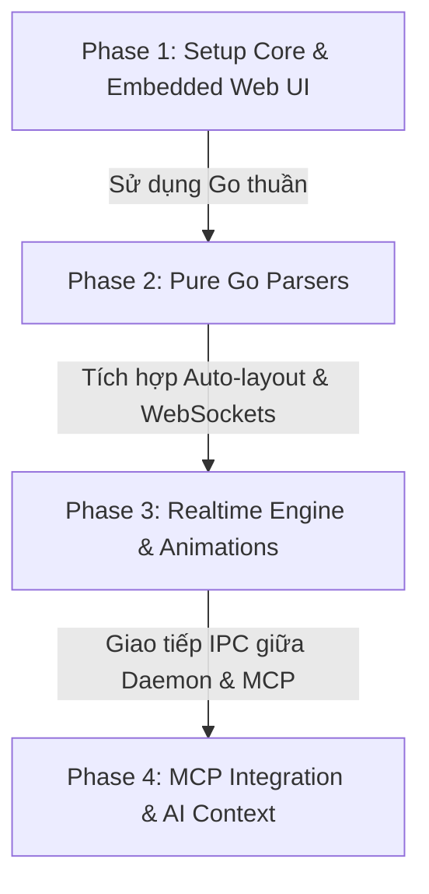

# Báo Cáo Đánh Giá, Phản Biện & Tối Ưu Hóa Tính Khả Thi Dự Án Loomiss

Dưới đây là bản đánh giá chi tiết và các đề xuất tối ưu hóa tính khả thi cho bản kế hoạch dự án **Loomiss** (công cụ giám sát kiến trúc động thời gian thực). Các đề xuất này tập trung vào việc đơn giản hóa quá trình phát triển, đảm bảo khả năng đóng gói Single Binary thực tế, tối ưu hóa hiệu năng và nâng cao trải nghiệm người dùng.

---

## 1. Đánh giá tổng quan (Overall Assessment)

* **Tính độc đáo & Ý nghĩa:** Ý tưởng cực kỳ xuất sắc. Trong kỷ nguyên AI Coding Agents phát triển vũ bão, việc có một công cụ trực quan hóa kiến trúc hệ thống theo thời gian thực (Real-time Dynamic Visualizer) giúp lấp đầy "điểm mù" của các DevOps và Developer.
* **Mức độ phức tạp:** Trung bình - Cao. Việc kết hợp giữa phân tích cú pháp tĩnh (Static Parsing), File Watcher thời gian thực, WebSocket và tích hợp giao thức MCP yêu cầu sự đồng bộ chặt chẽ giữa Backend (Go) và Frontend (React Flow).
* **Điểm sáng:** Lựa chọn Go làm Single Binary kết hợp `go:embed` giúp việc phân phối công cụ cực kỳ gọn nhẹ và chuyên nghiệp (đúng chuẩn tư duy DevOps).

---

## 2. Các điểm phản biện & Đề xuất tối ưu hóa (Critiques & Optimizations)

### 📌 Vấn đề 1: Trở ngại CGO từ Tree-sitter & Giải pháp Pure Go Parsers
> [!WARNING]
> **Rủi ro lớn nhất đối với mục tiêu "Single Binary dễ phân phối".**

* **Phản biện:** Bản kế hoạch đề xuất sử dụng `Tree-sitter` (Go bindings) để parse các file cấu hình (`docker-compose.yml`, Terraform, Nginx). Tuy nhiên:
  * Tree-sitter yêu cầu **CGO** (C Go bindings) để biên dịch. Việc sử dụng CGO sẽ phá hỏng khả năng cross-compile (biên dịch chéo) dễ dàng của Go. Bạn sẽ phải cài đặt các GCC toolchains phức tạp cho từng nền tảng đích (Windows, macOS, Linux, ARM64, AMD64).
  * Tree-sitter cực kỳ mạnh cho việc xây dựng AST của các ngôn ngữ lập trình phức tạp để highlight hoặc viết compiler, nhưng lại quá cồng kềnh và không tối ưu cho các file cấu hình có cấu trúc rõ ràng.
* **Giải pháp tối ưu (Pure Go):** Loại bỏ hoàn toàn Tree-sitter và thay thế bằng các thư viện thuần Go (Pure Go Libraries). Điều này giúp lệnh compile chạy mượt mà trên mọi OS chỉ với `GOOS` và `GOARCH` mà không cần cài đặt thêm dependency nào:
  * **Docker-compose (YAML):** Sử dụng `gopkg.in/yaml.v3`. Thư viện này cho phép parse YAML thành các cấu trúc dữ liệu Go rất dễ dàng, có hỗ trợ lấy thông tin dòng/cột (line/column) nếu cần hiển thị lỗi chi tiết.
  * **Terraform (.tf / HCL):** Sử dụng thư viện chính thức của HashiCorp viết bằng Go: `github.com/hashicorp/hcl/v2`. Đây là thư viện thuần Go cực kỳ mạnh mẽ, xử lý hoàn hảo cú pháp Terraform.
  * **Nginx Configuration:** Sử dụng các parser thuần Go có sẵn như `github.com/tengine/nginx-config-parser` hoặc tự viết một lexer/parser đơn giản trong Go (cú pháp Nginx dạng lồng nhau rất dễ parse bằng thuật toán đệ quy đệ quy).
* **Kết quả:** Quá trình compile cực nhanh, file binary đầu ra siêu nhỏ gọn (chỉ khoảng 15-25MB), không phụ thuộc vào thư viện C của hệ thống.

---

### 📌 Vấn đề 2: Thuật toán tự động sắp xếp vị trí Node (Auto-layout Engine)
> [!IMPORTANT]
> **React Flow chỉ là thư viện render, không tự động sắp xếp vị trí.**

* **Phản biện:** React Flow yêu cầu tọa độ `(x, y)` cho mỗi Node. Nếu Backend chỉ parse ra danh sách các Service và Connection (Edges) rồi đẩy lên UI, tất cả các Node sẽ bị xếp chồng lên nhau tại tọa độ `(0, 0)`. Việc bắt người dùng tự kéo thả để sắp xếp sơ đồ mỗi lần hệ thống quét lại là một trải nghiệm rất tệ.
* **Giải pháp tối ưu:** Tích hợp một **Layout Engine** tự động ở phía Frontend để tính toán tọa độ tự động theo cấu trúc cây hoặc luồng (Hierarchical Layout):
  * Sử dụng **Dagre** (qua thư viện `@reactflow/dagre` hoặc tích hợp thủ công `dagre.js`). Dagre rất nhẹ và hoạt động trực tiếp trên trình duyệt.
  * Hoặc sử dụng **ELK** (`elkjs`) nếu sơ đồ cực kỳ phức tạp và cần độ tùy biến cao hơn.
  * Khi nhận dữ liệu từ WebSocket, Frontend sẽ chạy qua Dagre để gán tọa độ trực tiếp cho các Node trước khi render, đảm bảo sơ đồ luôn được căn chỉnh đẹp mắt, cân đối theo chiều ngang hoặc dọc.

---

### 📌 Vấn đề 3: Kiến trúc đồng bộ giữa CLI Daemon và MCP Server
> [!NOTE]
> **Cách xử lý khi có nhiều tiến trình chạy đồng thời.**

* **Phản biện:** 
  * Người dùng chạy `loomiss start` để mở Web UI và bật file watcher giám sát thư mục.
  * AI Agent (Cursor) kết nối với Loomiss qua cấu hình `mcp.json` và chạy lệnh `loomiss mcp` dưới dạng một tiến trình con (subprocess) của Cursor để giao tiếp qua `stdio`.
  * Lúc này chúng ta có 2 tiến trình độc lập. Làm sao tiến trình `loomiss mcp` (chạy bên trong Cursor) có thể báo hiệu cho tiến trình `loomiss start` (đang chạy Web UI) biết rằng AI đang chỉnh sửa file nào để nhấp nháy node tương ứng?
* **Giải pháp tối ưu (Inter-Process Communication - IPC):**
  * Tiến trình chính `loomiss start` sẽ mở một HTTP Server cục bộ (ví dụ: `http://localhost:18900`).
  * Khi Cursor gọi tool của `loomiss mcp` (ví dụ: gửi một event thông báo đang chỉnh sửa `database`), tiến trình `loomiss mcp` chỉ cần thực hiện một request HTTP POST ngắn gọn tới `http://localhost:18900/api/agent-activity`.
  * Server của `loomiss start` nhận request và ngay lập tức bắn thông tin qua WebSocket để Web UI kích hoạt hiệu ứng pulsing/highlight trên Node tương ứng.
  * Nếu Server chính chưa chạy, tiến trình `loomiss mcp` vẫn chạy độc lập và trả về dữ liệu bình thường cho Cursor mà không gây lỗi.

---

### 📌 Vấn đề 4: Khả năng chịu lỗi và giữ trạng thái (Fault Tolerance & Debouncing)
> [!TIP]
> **Đảm bảo trải nghiệm mượt mà khi nhà phát triển đang gõ phím.**

* **Phản biện:** Khi lập trình viên hoặc AI đang viết dở cấu hình (ví dụ: gõ `ports: - ` và chưa điền port), file cấu hình sẽ bị lỗi cấu pháp tạm thời. Nếu file watcher lập tức quét và parse, hệ thống sẽ báo lỗi liên tục. Nếu Web UI xóa sạch sơ đồ hoặc báo lỗi đỏ lòm mỗi khi ta gõ phím, trải nghiệm sẽ cực kỳ khó chịu.
* **Giải pháp tối ưu:**
  * **Debouncing thông minh:** Đặt thời gian chờ (ví dụ: 1000ms - 1500ms) sau sự kiện thay đổi file cuối cùng mới thực hiện parse.
  * **Cơ chế LKG (Last Known Good):** Nếu parse bị lỗi cú pháp, Backend KHÔNG gửi sơ đồ rỗng hay sơ đồ lỗi lên UI. Thay vào đó, giữ nguyên sơ đồ hợp lệ gần nhất (LKG) trên UI, đồng thời hiển thị một chấm đỏ cảnh báo nhỏ ở góc màn hình báo hiệu: *"Cấu hình hiện tại có lỗi cú pháp, đang hiển thị sơ đồ gần nhất"*.
  * Điều này giữ cho giao diện luôn ổn định và mượt mà.

---

### 📌 Vấn đề 5: Nâng tầm thẩm mỹ giao diện (Premium Visual Aesthetics)
> [!TIP]
> **Biến Loomiss thành một tác phẩm nghệ thuật công nghệ để "WOW" người dùng.**

* **Chế độ tối (Dark Mode) mặc định:** Sử dụng bảng màu cao cấp như Slate/Zinc làm nền chính, kết hợp với các đường viền neon (Cyan cho Web, Purple cho Backend, Amber cho Database) để tạo cảm giác Cyberpunk hiện đại.
* **Hiệu ứng chuyển động (Micro-animations):**
  * Các đường kết nối (Edges) giữa các Service không chỉ là nét vẽ tĩnh mà có các luồng sáng (pulsing dots) chạy dọc theo hướng của Traffic.
  * Khi một node được cập nhật hoặc tạo mới, áp dụng hiệu ứng "fade-in" kèm theo vòng tròn lan tỏa (ripple effect).
* **Tính năng "Traffic Simulator" (Chạy thử luồng):**
  * Thêm một nút bấm "Simulate Request" trên UI. Khi bấm, một gói tin giả lập (dưới dạng một chấm sáng neon lớn) sẽ chạy từ Client Node -> Nginx Node -> Main App Node -> Database Node để người dùng hình dung rõ nét nhất luồng đi của dữ liệu.

---

## 3. Bản Kế hoạch Triển khai Tối ưu hóa (Optimized Implementation Roadmap)

### 🗓️ Lộ trình chi tiết:

#### **Phase 1: Khung xương Single Binary (Tuần 1)**
* **Frontend:** Khởi tạo Vite + React + React Flow + Tailwind CSS. Tạo giao diện UI Dark Mode cao cấp. Cấu hình layout engine **Dagre** để tự động căn chỉnh sơ đồ.
* **Backend:** Viết Go HTTP Server cơ bản. Đóng gói assets của frontend vào binary bằng `go:embed`.
* **Kết quả:** Chạy file binary duy nhất, tự động mở trình duyệt hiển thị giao diện sơ đồ mẫu được tự động sắp xếp tuyệt đẹp.

#### **Phase 2: Tích hợp các Parser thuần Go (Tuần 2)**
* Tích hợp `gopkg.in/yaml.v3` để quét các tệp `docker-compose.yml`.
* Tích hợp `github.com/hashicorp/hcl/v2` để quét các thư mục chứa file Terraform `.tf`.
* Viết parser cấu hình Nginx cơ bản bằng Go.
* Xây dựng cấu trúc dữ liệu thống nhất (Graph Schema): định nghĩa Node (ID, Name, Type, Status) và Edge (Source, Target, Label, Active).
* **Kết quả:** Chỉ cần chỉ định đường dẫn thư mục, Loomiss tự động quét và vẽ chính xác toàn bộ kiến trúc hạ tầng cục bộ mà không cần cài đặt compiler C nào.

#### **Phase 3: Event Watcher & Hiệu ứng Realtime (Tuần 3)**
* Tích hợp `fsnotify` để theo dõi thay đổi file.
* Viết cơ chế debouncing bằng Goroutines và Channels trong Go.
* Thiết lập WebSocket server trong Go và client ở React.
* Thêm các hiệu ứng animation (pulsing edges, ripple nodes) và xử lý lỗi cú pháp bằng cơ chế hiển thị trạng thái LKG (Last Known Good).

#### **Phase 4: Tích hợp MCP & Giao tiếp IPC (Tuần 4)**
* Viết lệnh `loomiss mcp` chạy giao thức MCP qua stdio.
* Thiết lập cơ chế IPC: Tiến trình MCP gửi tin nhắn qua HTTP API nội bộ tới daemon chính `loomiss start` để đồng bộ trạng thái thời gian thực.
* Khai báo các công cụ MCP để Cursor có thể đọc sơ đồ kiến trúc hiện tại và chủ động cập nhật ngữ cảnh khi viết code.

---

Bản kế hoạch tối ưu này loại bỏ hoàn toàn các rủi ro kỹ thuật liên quan đến cross-compilation (do loại bỏ Tree-sitter/CGO) và giải quyết triệt để bài toán hiển thị sơ đồ (qua Dagre Auto-layout) cùng sự phối hợp giữa các tiến trình (qua IPC). Dự án hoàn toàn có khả năng triển khai thành công cực kỳ cao và thực tiễn.
