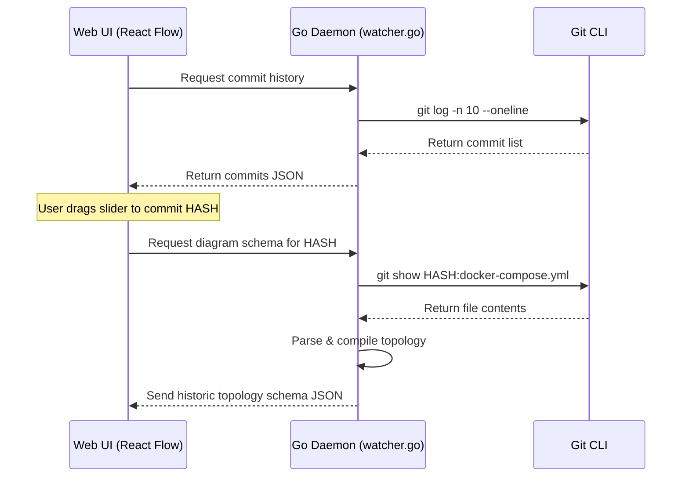

# Phase 6 Spec: Infrastructure Digital Twin & Shift-Left Guardrails

This document outlines the detailed engineering specs and technical implementations for the four advanced DevOps features introduced in Phase 6.

---

## 1. Time Travel Slider (Git History Integration)

### Objective
Allow users to inspect previous architectural configurations dynamically using a Time Slider in the Web UI, comparing historic nodes/edges with the active working tree.

### Technical Design


* **No Disk Checkout**: The daemon MUST NOT run `git checkout`. All operations use `git show` to read historical data directly into memory to prevent workspace locking.
* **UI Indicator**: A slider at the bottom of the page (`fixed bottom-4 left-1/2 transform -translate-x-1/2 z-40 bg-zinc-900/90 border border-zinc-800 ...`).
* **Visual Diffing**:
  * Newly added nodes glow green.
  * Deleted nodes show in faded dashed outlines with a red marker.
  * Modified node borders glow yellow.

---

## 2. Live-Shadow Observability (Background Probing)

### Objective
Provide lightweight status telemetry to verify if services exposed in files (Docker Compose or Terraform) are actually alive and reachable.

### Technical Design
* **Daemon Prober (Go)**:
  * A persistent Goroutine runs a loop every 10 seconds.
  * Extracted node ports (e.g., `8888` for Postgres, `80` for Nginx) are queried:
    ```go
    conn, err := net.DialTimeout("tcp", "localhost:8888", 2*time.Second)
    if err != nil {
        // Node is offline/unreachable
    }
    ```
* **Event Broadcast**:
  * If a service status shifts (`ONLINE` <-> `OFFLINE`), the daemon broadcasts a `SERVICE_STATUS_CHANGE` websocket payload:
    ```json
    {
      "type": "SERVICE_STATUS_CHANGE",
      "nodeId": "database",
      "status": "OFFLINE",
      "error": "Connection refused"
    }
    ```
* **UI Representation**:
  * Offline nodes change their border color to a pulsing bright red.
  * An `OFFLINE` badge replaces the telemetry metric, and the node's traffic edges fade or turn red to show blocked transmission.

---

## 3. Agentic Advisor (Pre-Save Impact Analysis)

### Objective
Leverage LLM reasoning via Topology GraphRAG to alert developers about architectural breakage *before* changes are committed to the file system.

### Technical Design
* **Interception Hook**:
  * The frontend monitors active editor text changes (debounced by 1.5s).
  * If configuration modifications are detected (e.g., port changes), the frontend compiles a mock graph diff.
* **Prompt context**:
  ```text
  Active Topology: Nginx (port 80) -> Sneakers-API (port 8080) -> Database (port 5432).
  Proposed Diff: Change Database port mapping from 5432:5432 to 5433:5432.
  Analyze if this breaks active dependencies.
  ```
* **Response Output**:
  * If a dependency breaks, display a visual toast alert at the top of the canvas:
    * `"Warning: Modifying database port maps breaks 1 active dependency (Sneakers-API connects via 5432)."`

---

## 4. LLM-Guided Packet Trace Simulation (Network Sandbox)

### Objective
Allow developers to click any source and destination nodes to simulate routing packets along edges, verifying proxy settings, headers, and firewall rules in an LLM sandbox.

### Technical Design
* **User Trigger**:
  * Click "Simulate Packet Routing" button.
  * Choose Source (e.g., `Nginx Proxy`) and Destination (e.g., `Go Backend`).
* **AI Pathing Execution**:
  * Prompt Gemini with the routing configuration and ports.
  * Ask the model to trace headers (`X-Forwarded-For`, `Host`) and response codes through the route.
* **Canvas Animation**:
  * A glowing node/dot travels sequentially along the SVGs representing edges from Source to Target.
  * At each step, a popover overlay shows mock headers and trace statuses.
