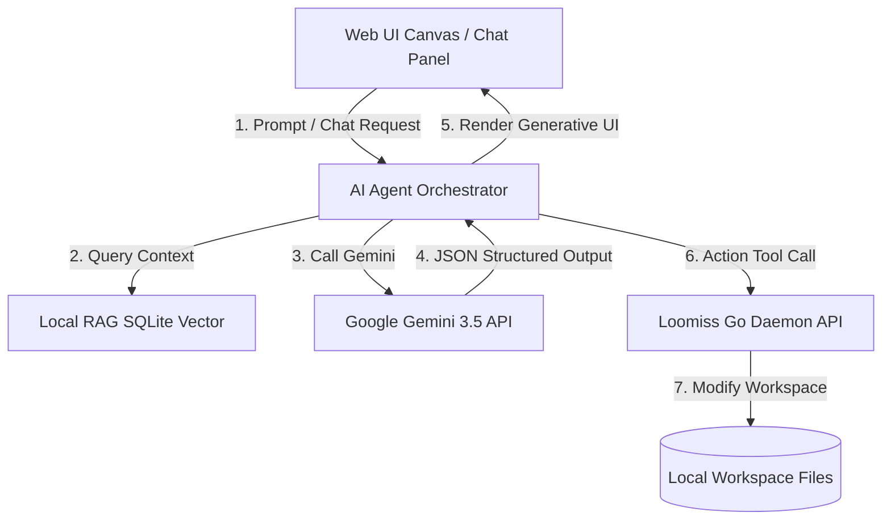

# Phase 7: Advanced Agentic AI Copilot & Generative UI (Kiến trúc AI Tác tử & Giao diện Tự sinh)

## 1. Mục tiêu (Goals)
Nâng cấp khả năng AI của Loomiss từ mức **"Hỏi - Đáp dạng văn bản tĩnh"** lên mức **"AI Tác tử hoạt động thời gian thực (Agentic AI)"** và **"Giao diện tự sinh (Generative UI)"**. Đưa các kỹ thuật tối ưu hóa LLM thịnh hành nhất vào DevTool để mang lại trải nghiệm tối ưu nhất cho lập trình viên.

Các trụ cột chính của Phase 7:
*   **Structured Output & Graph Highlights**: Ép cấu trúc đầu ra (JSON Schema) của Gemini để điều khiển trạng thái đồ thị (visual state) trên canvas (ví dụ: tự động đánh dấu viền đỏ nhấp nháy cho các node bị phát hiện lỗi bảo mật).
*   **Agentic Tool Use (Function Calling)**: Cho phép AI đề xuất và tự động thực thi các tác vụ sửa đổi cấu hình (`docker-compose.yml`, `nginx.conf`, `.env`) thông qua API của Go daemon sau khi được người dùng phê duyệt.
*   **Generative UI (Giao diện Tự sinh)**: Chatbox không chỉ trả về Markdown tĩnh mà trả về các khối giao diện tương tác (interactive widgets) như: khối Diff chỉnh sửa code trực quan, nút bấm thực thi Docker Cmd, hoặc biểu đồ tài nguyên tương tác.
*   **RAG Contextual Memory (SQLite Vector Search)**: Lập chỉ mục toàn bộ file cấu hình, hướng dẫn vận hành (runbook) và lịch sử hoạt động của hệ thống vào cơ sở dữ liệu Vector để tối ưu hóa Prompt Context đầu vào.

---

## 2. Thiết kế chi tiết & Kỹ thuật Wow (Detailed Design & Wow Techniques)



### 2.1. Structured Output & Visual Graph Highlights (Ép cấu trúc & Đánh dấu trực quan)
Thay vì để Gemini trả về văn bản tự do, chúng ta ép cấu trúc API thông qua `responseSchema` (hoặc JSON mode) của Gemini API.

**JSON Schema mẫu:**
```json
{
  "summary": "Phát hiện DB Postgres bị map cổng ra public internet và thiếu Reverse Proxy.",
  "vulnerable_nodes": [
    {
      "node_id": "db",
      "severity": "HIGH",
      "reason": "PostgreSQL Container map cổng 5432 trực tiếp ra ngoài máy host thay vì chỉ kết nối nội bộ qua mạng Docker."
    }
  ],
  "proposed_actions": [
    {
      "action_type": "MODIFY_PORT",
      "target_file": "docker-compose.yml",
      "service": "db",
      "original_ports": "5432:5432",
      "suggested_ports": "expose 5432"
    }
  ]
}
```
**Cách xử lý tại Frontend:**
1. Parse JSON đầu ra từ Gemini.
2. Cập nhật `nodes` trong Zustand Store: thêm thuộc tính `isVulnerable: true`, `severity: 'HIGH'`, và lý do tương ứng.
3. Trong `ArchitectureNode.tsx`, khi nhận diện flag `isVulnerable`, component sẽ tự động render thêm badge **Cảnh báo nhấp nháy ⚠️** và đổi viền neon sang đỏ.

---

### 2.2. Agentic Tool Use (Thực thi hành động qua Function Calling)
Cung cấp cho LLM các "công cụ" để tương tác với Workspace cục bộ của người dùng.

**Danh sách Tools đăng ký với Gemini:**
*   `read_file_content(path)`: Đọc nội dung tệp tin cấu hình.
*   `write_file_patch(path, patch)`: Áp dụng bản vá/thay đổi tệp cấu hình.
*   `restart_container(container_id)`: Khởi động lại container sau khi sửa đổi.

**Luồng hoạt động:**
1. AI phân tích log lỗi của `app` service và nhận ra cấu hình biến môi trường kết nối Database bị sai.
2. AI quyết định gọi tool `write_file_patch` để cập nhật file `.env` hoặc `docker-compose.yml`.
3. Giao diện hiển thị một card xác nhận: **"AI Architect đề xuất cập nhật cấu hình cổng kết nối của container 'app'. Bạn có đồng ý thực thi không?"** kèm nút **[Đồng ý (Approve)]** / **[Từ chối (Reject)]**.
4. Khi ấn **Approve**, Frontend gọi Go Daemon thực thi cập nhật file thực tế trong ổ đĩa và khởi động lại container bằng Docker SDK.

---

### 2.3. Generative UI (Giao diện Tự sinh trong khung Chat)
Thay đổi trải nghiệm chat truyền thống bằng cách tạo các Components động tùy thuộc vào nội dung phản hồi.

*   **Diff Code Viewer Block**: Khi AI đề xuất sửa đổi file `nginx.conf`, thay vì in ra code block thường, UI tự sinh một bộ so sánh Diff (Before/After) trực quan màu Xanh/Đỏ để lập trình viên dễ theo dõi.
*   **Terminal Command Runner**: Nếu AI khuyên người dùng chạy lệnh dọn dẹp hệ thống Docker (`docker system prune`), chatbox sẽ render một khối nút bấm hành động dạng: `[Run command: docker system prune]` để người dùng chỉ cần click chuột thay vì copy paste lệnh ra terminal.

---

### 2.4. Advanced RAG Architecture for Loomiss (Kiến trúc RAG tối ưu hóa đặc thù)
Loomiss không sử dụng giải pháp RAG truyền thống (Naive RAG) vốn dễ làm mất cấu trúc mã nguồn. Thay vào đó, chúng ta áp dụng các kỹ thuật RAG thế hệ mới phù hợp nhất với dữ liệu hạ tầng và code của dự án:

1. **Topology GraphRAG (Tận dụng đồ thị cấu trúc có sẵn)**:
   * Loomiss **đã có sẵn** cấu trúc Graph dạng JSON (Nodes & Edges) parse từ Docker Compose/Terraform. Ta không cần dùng LLM để trích xuất thực thể (entity extraction) như GraphRAG thông thường.
   * Thay vào đó, mỗi chunk văn bản (cấu hình tệp tin, logs) khi lưu vào Vector DB sẽ được gắn nhãn (metadata) liên kết trực tiếp với `node_id`. Khi tìm kiếm, AI có thể truy vấn đa bước (Multi-hop reasoning): từ lỗi log của container `app` -> tìm các kết nối (edges) tới `db` -> lấy cấu hình mạng của `db` để đối chiếu.

2. **Structure-Aware & Semantic Chunking (Cắt phân mảnh thông minh theo cấu trúc)**:
   * Cắt mã nguồn hoặc file cấu hình YAML theo số từ cố định (Fixed-size chunking) sẽ phá vỡ cú pháp.
   * Ta áp dụng **Structure-Aware Chunking**: phân tách tài liệu dựa trên các khối cú pháp logic (ví dụ: từng khối service cụ thể trong file `docker-compose.yml`, từng block server/location trong `nginx.conf`, từng struct/method trong code Go).
   * **Gắn Metadata giàu thông tin**: Mỗi phân mảnh được tự động đính kèm đường dẫn tiêu đề (heading path), quan hệ cha-con trực tiếp (parent-child mappings) vào nội dung để mô hình nhúng (embedding) có thể định vị chính xác vị trí tương đối của phân mảnh trong toàn bộ hệ thống hạ tầng.

3. **Hybrid Search & Re-ranking (Tìm kiếm hỗn hợp)**:
   * Dữ liệu cấu hình hạ tầng chứa rất nhiều từ khóa cụ thể như số cổng (`5432`, `8080`) hoặc tên biến (`DB_PASSWORD`). Vector Search thuần túy (Dense retrieval) rất dễ bỏ sót các ký tự chính xác này.
   * Sử dụng **Hybrid Search**: kết hợp Tìm kiếm từ khóa truyền thống (Sparse retrieval như BM25/TF-IDF) và Tìm kiếm ngữ nghĩa Vector (Dense retrieval).
   * **Thuật toán kết hợp (Fusion)**: Áp dụng thuật toán **Reciprocal Rank Fusion (RRF)** để tự động gom và xếp hạng lại kết quả từ hai hướng tìm kiếm mà không cần cấu hình siêu tham số phức tạp, trước khi đưa qua lớp Re-ranker Cross-encoder siêu nhẹ.

4. **Self-Routing Context Selector (Bộ điều hướng ngữ cảnh động)**:
   * Với các dự án nhỏ có lượng cấu hình < 100KB, ta sử dụng chiến lược **Long Context Window**: gửi toàn bộ đặc tả hệ thống trực tiếp vào Gemini 3.5 Flash để tận dụng khả năng suy luận toàn cục (Global reasoning) mà không cần RAG.
   * Với dự án lớn hoặc khi cần đối chiếu tệp logs dung lượng lớn, hệ thống tự động điều hướng (Self-Route) sang **Agentic RAG**: truy xuất thông tin có chọn lọc bằng cách cho phép AI Agent tự lập kế hoạch tìm kiếm nhiều lần (Self-RAG) và tự động yêu cầu đọc thêm logs nếu thông tin thu thập được chưa đủ để chẩn đoán.

---

### 2.5. Chiến lược triển khai từng bước (Incremental Implementation Strategy)
Để kiểm soát độ phức tạp và tránh việc quá tải ngay từ đầu, quá trình phát triển sẽ tuân thủ nguyên tắc thực tế:
1. **Bước 1: Basic RAG**: Xây dựng trước một hệ thống RAG cơ bản với cơ sở dữ liệu SQLite, lưu trữ embeddings và logs thô, đánh giá hiệu năng và giới hạn thực tế trên tệp dữ liệu của Loomiss.
2. **Bước 2: Hybrid & Metadata Enhancement**: Bổ sung Hybrid Search (RRF) và đính kèm metadata cha-con, tiêu đề vào chunk để tối ưu độ chính xác của kết quả truy xuất.
3. **Bước 3: Graph & Agentic Integration**: Tích hợp các lớp Graph (Topology Link) và tính năng chủ động (Agentic query/Self-RAG) khi nhu cầu suy luận đa bước thực sự phát sinh.

---

## 3. Lộ trình triển khai (Roadmap)

### Giai đoạn 1: Ép cấu trúc đầu ra & Đánh dấu đồ thị (Visual Audit)
*   [ ] Cấu hình JSON schema đầu ra cho prompt audit trong `App.tsx`.
*   [ ] Cập nhật Zustand store để hỗ trợ trạng thái `vulnerabilities` của các nodes.
*   [ ] Cải tiến `ArchitectureNode.tsx` để hiển thị lỗi nhấp nháy ⚠️ trực quan.

### Giai đoạn 2: Tích hợp Generative UI & Action Tools (Agentic Actions)
*   [ ] Viết Custom Components hiển thị Code Diff và Button Runner cho Chatbox.
*   [ ] Bổ sung các API endpoint ghi đè file cấu hình (`/api/write-patch`) và restart container (`/api/restart`) trong Go backend.
*   [ ] Liên kết Gemini Function Calling để AI tự sinh hành động tool use.

### Giai đoạn 3: Tích hợp ngữ cảnh RAG nâng cao (Advanced RAG Integration)
*   [ ] **Phát triển Basic RAG**: Xây dựng cơ sở dữ liệu SQLite để lưu trữ embeddings và tệp logs thô.
*   [ ] **Nâng cấp Hybrid & Chunking**: Thiết lập bộ parser Structure-Aware Chunking kèm metadata phong phú và triển khai Hybrid Search kết hợp xếp hạng Reciprocal Rank Fusion (RRF).
*   [ ] **Triển khai Graph & Agentic RAG**: Tích hợp liên kết Topology Graph có sẵn của Loomiss với Vector DB và xây dựng bộ điều hướng Self-Routing cùng cơ chế tự sửa lỗi (Self-RAG).
